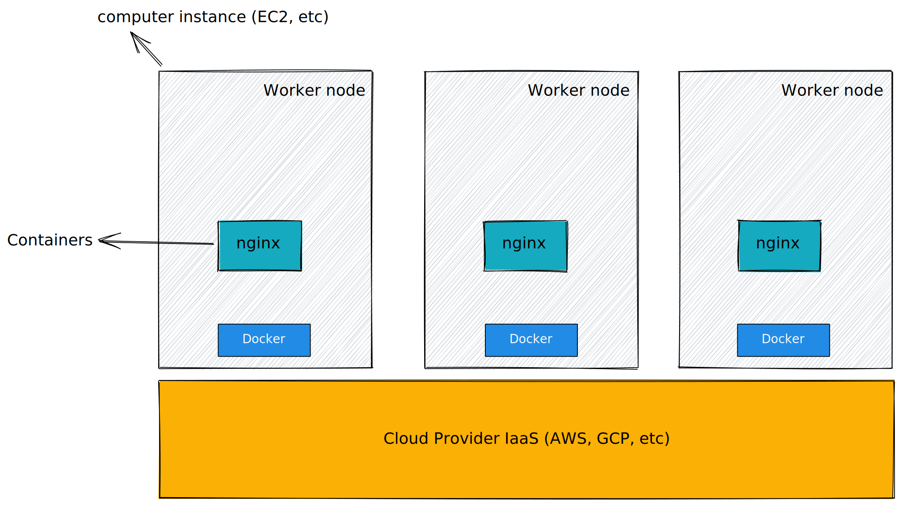
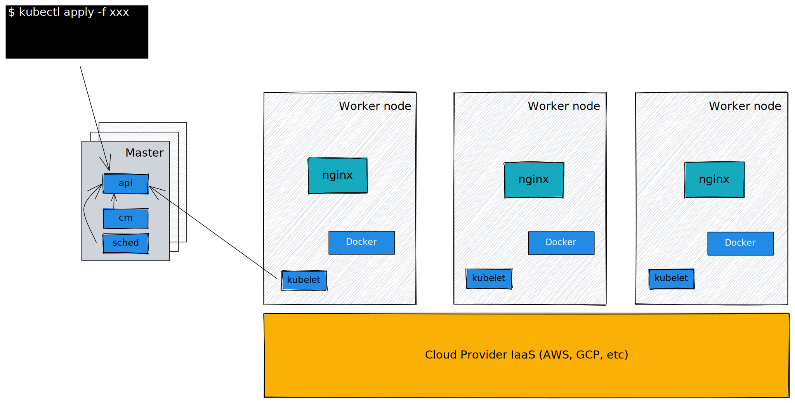

# Kubernetes: an introduction

---

# What I'm going to share

## internal components
## operation model
## API and resource model
## A little about Borg paper

---

# What I'm NOT going to cover today

## networking mechanisms
## PayPay's kubernetes setup
## programming interface

(maybe next time)

---

# First, an overview

```bash
$ kubectl apply -f nginx-deploy.yaml
```
```yaml
apiVersion: apps/v1
kind: Deployment
metadata:
  name: nginx-deployment
  labels:
    app: nginx
spec:
  replicas: 3
  selector:
    matchLabels:
      app: nginx
  template:
    metadata:
      labels:
        app: nginx
    spec:
      containers:
      - name: nginx
        image: nginx:1.14.2
        ports:
        - containerPort: 80
```

---



---

# Wait, I heard there is a... Master?

---

# Master(s)


---


---

# all components



---

# API Object model

```yaml
apiVersion: v1
kind: Pod
metadata:
  name: pod-example
spec:
  containers:
  - name: ubuntu
    image: ubuntu:trusty
    command: ["echo"]
    args: ["Hello World"]
```

---


---

# what is `controller-manager` ?


---

# decompose a Deployment


---

# how does scheduling work?

- filter
- score

---

# operation model

- declerative command
- state reconcile

---

# rolling upgrade explained
```diff
spec:
-  replicas: 40
+  replicas: 70

-    image: docker.baymax.jp/wallet-main:v1
+    image: docker.baymax.jp/wallet-main:v2
```

## what happens if we run this?
```bash
kubectl apply -f new-deploy.yaml
```

---


---

# Now, let's talk a little about `Borg`

---
# History

- Google's published the [Borg paper](https://research.google/pubs/pub43438/) at _2015_
  - used inside Google for at least *a decade*
- [Google announce](https://en.wikipedia.org/wiki/Kubernetes) Kubernetes Porjects at _mid-2014_
- Kubernetes v1.0 release at _July 2015_

---

# Problem to solve

- run applications in large scale data-centers, with heterogenous machines types
- google's scale
  - cluster: 10^2
  - machine: 10^4
  - jobs: 10^5
  - application: 10^3

---

# Scheduling unit

- Jobs: like a deployment
  - tasks: a set of Linux processes running in a container (-> Pod)
- prod jobs: long running services (Gmail, BigTable, etc)
- non-prod jobs: batch, hours to days
- BCL: configuration language (-> yaml)
  - 10^4 files with 1k LoC, total 10^7 LoC
  

---

# Architecture


same:
- borgmaster -> api+cm, borglet -> kubelet
- scheduler

diff:
- no etcd
- runs on bare metal
- use Chubby and BNS for service discovery

---

# Keypoints

- Scalability
- Avaliablity
- Utilization

---

# Scalability
## scale
- 10^3 machines, 10^4 tasks per minute
- a busy Borgmaster: 10-14 CPU cores, 50GiB RAM
## strategy
- split scheduler to different component
- caching: machine score
- group tasks to _equivalence classes_
- randomization: random pick machine instead of calculating for all

---
# Availability

> already-running tasks continue to run

- if borgmaster fails: app still works
- if borglet fails: app still works

---

# Utilization

- how to evaluate: FauxMaster
  - high-fidelity simulator, read production checkpoints data
- mix prod and non-prod jobs
  - prod jobs already request more
  - non-prod jobs can use reclaimed resource
- over-selling at low priorities, kill low priority jobs when over-commit

---

# Lessons learned and improved in Kubernetes

check the paper, it's interesting

---

# resources to learn Kubernetes

- [Kubernetes The Hard Way](https://github.com/kelseyhightower/kubernetes-the-hard-way)
- [InfoQ.cn: 从 Borg 到 Kubernetes](https://www.infoq.cn/article/docker-container-cluster-management-part-01)